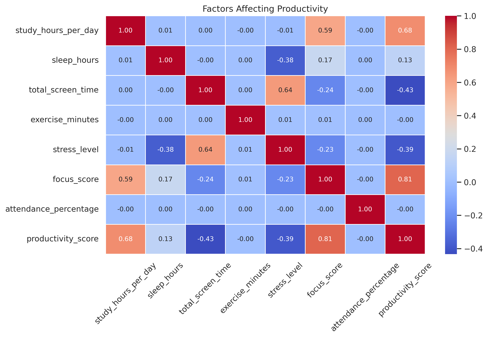
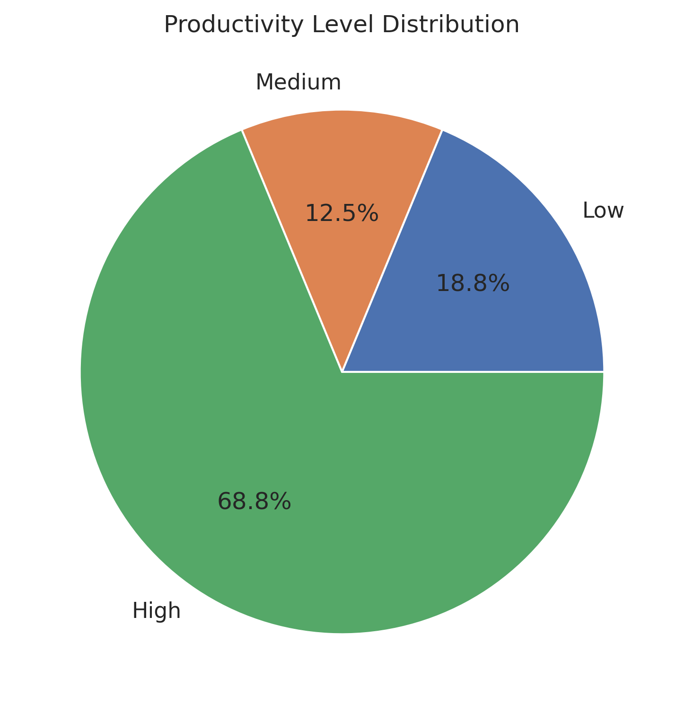
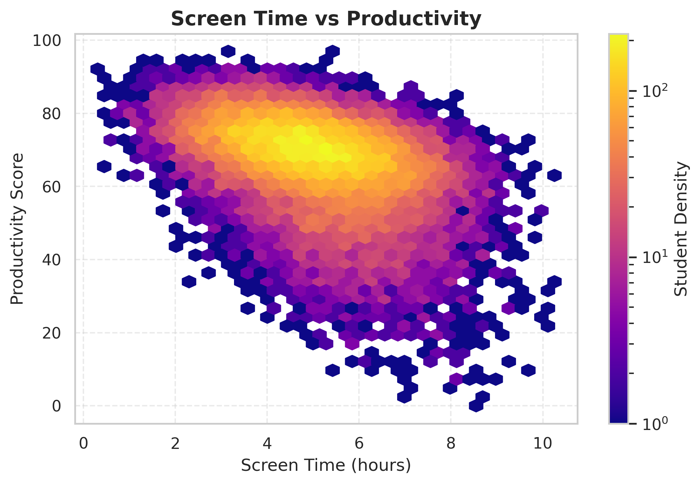
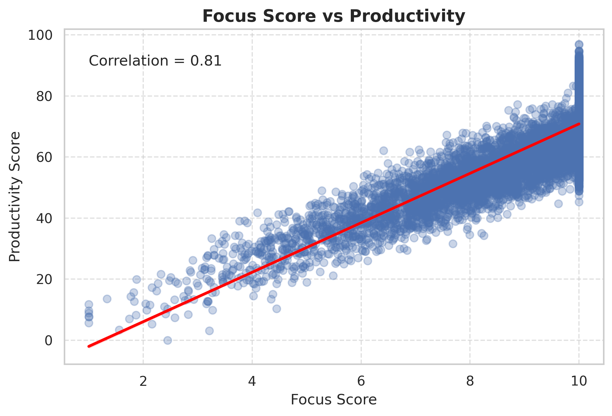

# Exploratory Data Analysis of Digital Distractions and Their Impact on Student Productivity

## Overview

This project explores the impact of digital distractions on student productivity through Exploratory Data Analysis (EDA). Using a dataset of 20,000 student records, the project identifies patterns and relationships between screen time, study habits, stress levels, sleep duration, focus scores, and overall productivity. The analysis demonstrates how data analytics can uncover meaningful insights to support informed decision-making.

## Objectives

* To analyze the impact of digital distractions on student productivity. 
* To perform Exploratory Data Analysis (EDA) on student behavior data. 
* To identify key factors like study hours, sleep, stress, and screen time. 
* To visualize data using graphs and charts. 
* To provide insights and recommendations for improving productivity. 


## Technologies Used

* Python
* Pandas
* NumPy
* Matplotlib
* Google Colab

## Key Analysis Performed

* Data Cleaning and Preprocessing
* Univariate Analysis
* Bivariate Analysis
* Multivariate Analysis
* Data Visualization
* Correlation Analysis

## Dataset

The dataset contains approximately **20,000 student records** with total 18 attributes including:

* Screen Time
* Study Hours
* Stress Level
* Sleep Duration
* Focus Score
* Productivity Score

## Key Insights

* Focus score is the most important factor for productivity.
* Optimal study time is around 6–8 hours/day. 
* Excessive screen time negatively impacts productivity. 
* Higher stress leads to lower performance. 
* Adequate sleep improves focus and productivity. 


## Project Structure

```
├── EDA_student_data_analysis.ipynb
├── student_productivity_dataset_cleaned.csv
├── README.md
|__ requirements.txt
|__ images
```

## How to Run

1. Clone this repository.
2. Open the Jupyter Notebook in Google Colab or Jupyter Notebook.
3. Install the required libraries:

   * Pandas
   * NumPy
   * Matplotlib
4. Run all notebook cells to reproduce the analysis and visualizations.

## Sample Visualizations

### Correlation Heatmap


### Productivity Score Distribution


### Screen Time vs Productivity


### Focus Score vs Productivity



## Author

**Ankita Devlekar**
